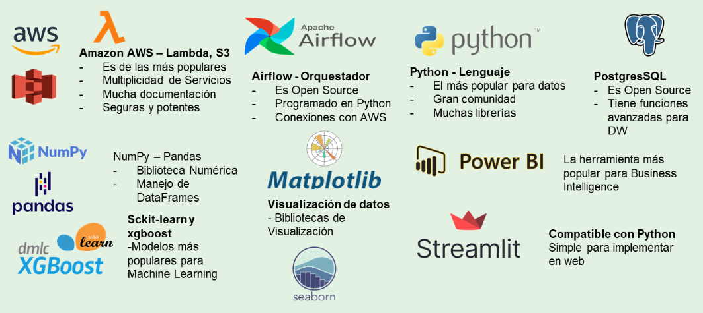
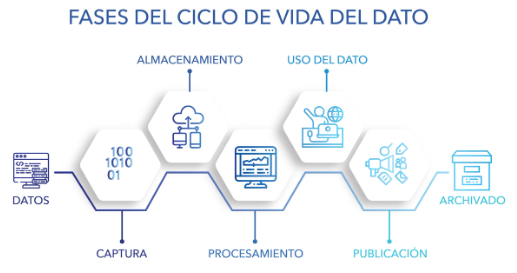
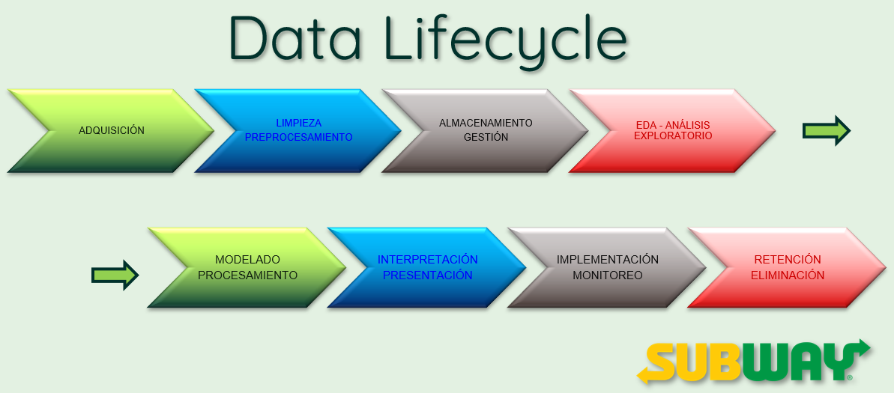
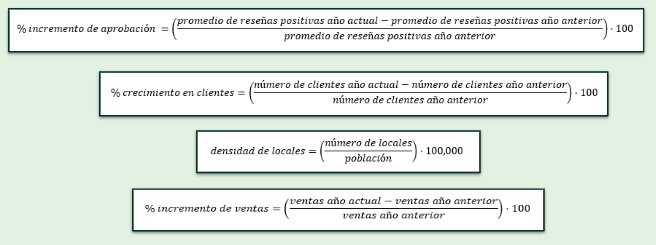
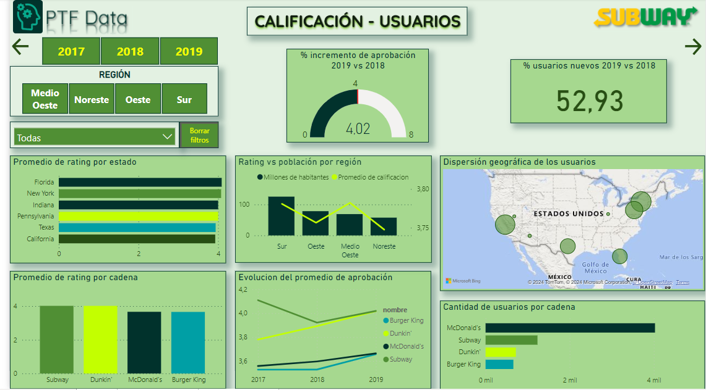
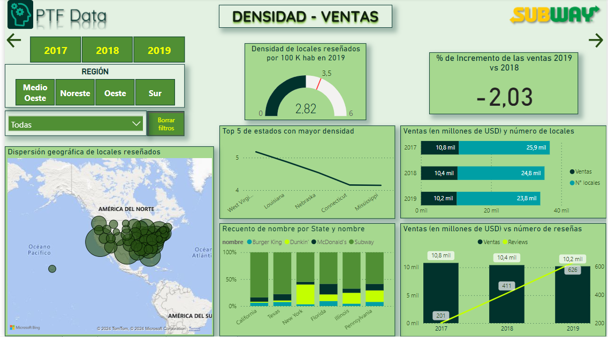
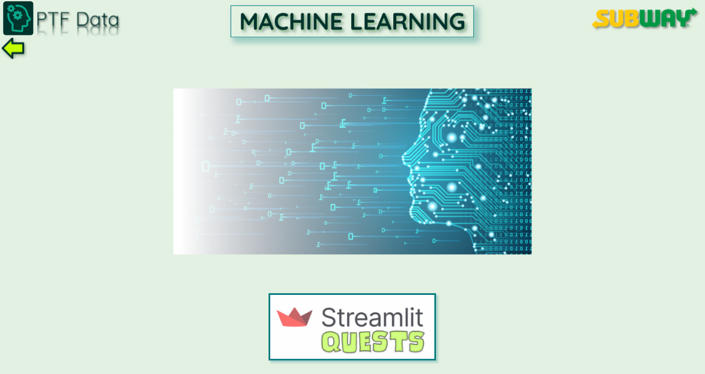
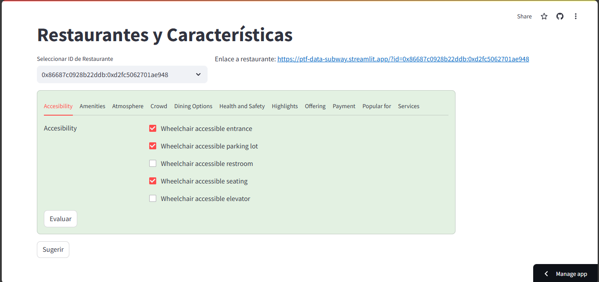
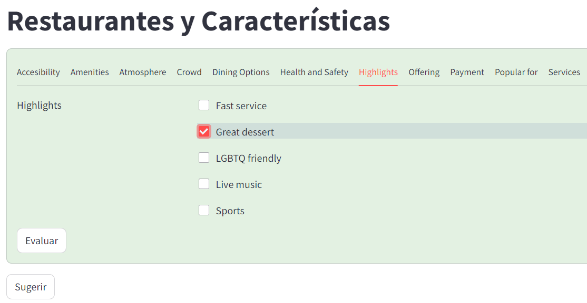
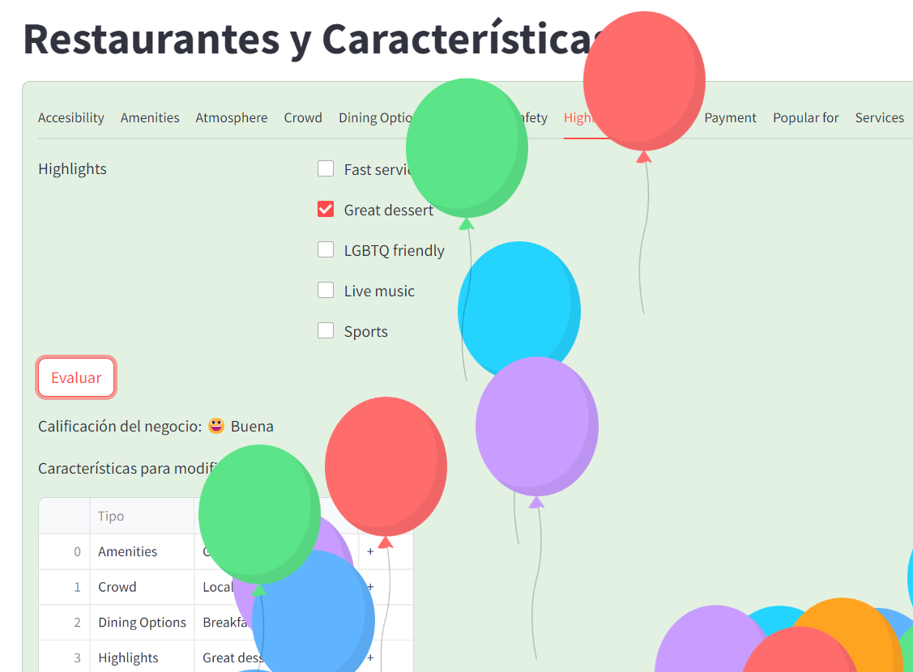

# Proyecto de Análisis de Opiniones y Recomendaciones en Yelp y Google Maps

## Descripción del Proyecto

Este proyecto se centra en el análisis de opiniones y recomendaciones de usuarios en las plataformas Yelp y Google Maps, con el objetivo de proporcionar información valiosa para la toma de decisiones estratégicas en el ámbito empresarial. Se utilizarán técnicas de procesamiento de lenguaje natural y aprendizaje automático para analizar las opiniones de los usuarios, identificar tendencias y patrones, y generar recomendaciones personalizadas.

El Cliente es un conglomerado de empresas de restaurantes y empresas afines.

El público del software es tanto turistas como restaurantes y negocios de comida similares.

Para los análisis así como para el entrenamiento del modelo, se considerará un periodo de 3 años, desde el 2017 al 2019; además, las 5 ciudades más turísticas y el 20% de los restaurantes mejor puntuados, esto aplicando la ley de Paretto.

## Objetivos del Proyecto

- *Recopilación y depuración de datos*: Se extraerán datos de las plataformas Yelp y Google Maps, depurarán y almacenarán en una base de datos para su posterior análisis.
- *Análisis de sentimientos*: Se analizarán las opiniones de los usuarios para identificar sentimientos positivos, negativos y neutros hacia los negocios y establecimientos analizados.
- *Identificación de tendencias*: Se utilizarán técnicas de análisis de datos para identificar tendencias y patrones en las opiniones de los usuarios, lo que permitirá a las empresas comprender mejor las necesidades y preferencias de sus clientes.
- *Desarrollo de un sistema de recomendación*: Se desarrollará un sistema de recomendación basado en las opiniones de los usuarios, que permitirá a los usuarios descubrir nuevos negocios y establecimientos en función de sus preferencias, gustos u otras características relacionadas, y de las experiencias pasadas.
- Predecir los rubros con más crecimiento o decaimiento en un periodo futuro.
- Identificar puntos clave para la instalación de nuevos locales.

## Tecnologías Utilizadas

- *Python*: Se utilizará Python como lenguaje de programación principal, junto con las bibliotecas Pandas, NumPy y Scikit-learn para el análisis de datos y el desarrollo de modelos de aprendizaje automático.
- *AWS*: Se utilizará el servicio S3 de AWS para la gestión y manipulación de la base de datos que almacenará los datos recopilados de Yelp y Google Maps.
- *PostgreSQL*: Se utilizará PostgreSQL para la gestión y manipulación de la base de datos del DataWarehouse.
- *Herramientas de visualización*: Se utilizarán herramientas de visualización de datos como PowerBI y Streamlit para el informe gerencial, así como las librerías Matplotlib y Seaborn para crear visualizaciones previas informativas y fácilmente comprensibles para el área tecnológica.
- *Otras tecnologías*: Se utilizarán otras tecnologías según sea necesario para el desarrollo y despliegue eficiente del proyecto.



## Entregables

- Base de datos depurada y actualizada con datos de Yelp y Google Maps.
- Informes de análisis detallados que resuman las tendencias y patrones identificados en las opiniones de los usuarios.
- Sistema de recomendación funcional que proporcione recomendaciones personalizadas a los usuarios.
- Documentación detallada que describa el proceso de recopilación de datos, análisis realizado y funcionamiento del sistema de recomendación.

## Equipo de Trabajo

Este proyecto será desarrollado por un equipo multidisciplinario de expertos en análisis de datos, aprendizaje automático y desarrollo de software. El equipo trabajará en estrecha colaboración para garantizar la entrega de un producto de alta calidad que cumpla con los objetivos del proyecto.


# Data Analytics

### Repositorio y Conjuntos de Datos

- El repositorio original del proyecto se encuentra disponible en [GitHub](https://github.com/soyHenry/PF_DS/blob/FULL-TIME/Proyectos/yelp-goople.md).

### Preprocesamiento de datos

- Se realiza la carga y limpieza de los conjuntos de datos utilizando Python y las siguientes librerías:

  - numpy
  - pandas

- Además, se puede revisar con más en detalle los pasos realizados dentro del notebook [`ETL DL.ipynb`](https://github.com/jalcantara777/SubwayCase/blob/main/ETL.ipynb) donde preparamos los datos para insertarlos en el DataLake; y del notebook [`ETL DW.ipynb`](https://github.com/jalcantara777/SubwayCase/blob/main/ETL.ipynb) donde se trabaja sobre los archivos del DataLake para su inserción en el DataWarehouse.

## Ciclo de vida de los datos



#### Adquisición de datos:

- En esta fase, se recolectan datos de diversas fuentes, como bases de datos, APIs, entre otros. Es crucial asegurar la calidad y la integridad de los datos desde su origen.

#### Limpieza y Preprocesamiento:

- Los datos adquiridos pueden contener ruido, valores faltantes o datos inconsistentes. En esta etapa, se realiza la limpieza de los datos para eliminar errores y se lleva a cabo el preprocesamiento necesario para prepararlos para su análisis posterior.

#### Almacenamiento y Gestión:

- Los datos limpios se almacenan en una infraestructura de almacenamiento adecuada, garantizando su seguridad y accesibilidad. Además, se establecen políticas de gestión de datos para administrar el acceso, la privacidad y la seguridad de los datos.

#### Análisis Exploratorio de Datos (EDA):

- En esta fase, se exploran los datos mediante técnicas estadísticas y visuales para comprender su estructura, identificar patrones y tendencias, y detectar posibles relaciones entre las variables.

#### Modelado y Procesamiento de Datos:

- Sobre la base de los insights obtenidos durante el análisis exploratorio, se construyen modelos predictivos o descriptivos para extraer información valiosa de los datos. Se utilizan técnicas de aprendizaje automático y minería de datos.

#### Interpretación y Comunicación de Resultados:

- Los resultados del análisis y del modelado se interpretan y se comunican de manera clara y efectiva a las partes interesadas. Se presentan hallazgos importantes, conclusiones y recomendaciones que puedan derivarse del estudio de los datos.

#### Implementación y Monitoreo:

- Los modelos desarrollados se implementan en entornos de producción, donde se utilizan para tomar decisiones o automatizar procesos. Se establecen mecanismos de monitoreo continuo para evaluar el rendimiento de los modelos y garantizar su actualización y mantenimiento.

#### Retención y Eliminación:

- Se definen políticas de retención de datos para determinar cuánto tiempo se conservarán los datos y en qué condiciones. También se establecen procedimientos para la eliminación segura de los datos cuando ya no sean necesarios o relevantes.



## KPIs

### Fórmulas



## Panel de datos o Dashboard





El siguiente enlace lleva al dashboard interactivo en la nube: [Dashboard on Cloud](https://app.powerbi.com/view?r=eyJrIjoiYzEyOTkxZWQtNzU5ZS00MzY0LTk0M2MtNWE2ODhjOTc0OWRlIiwidCI6Ijc1MDRlMzE4LThlMWUtNGQ1NS1iZmZkLTg3NWI0ZGVlODI2MCIsImMiOjR9&embedImagePlaceholder=true&pageName=c4ea6585a17c3b1d63b5)

La versión local del archivo se encuentra en la carpeta [Dashboard](https://github.com/jalcantara777/SubwayCase/blob/main/Dashboard/).

## Modelo de Machine Learning

Se puede consultar la información entregada por el modelo en el siguiente enlace: [Streamlit](https://ptf-data-subway.streamlit.app/?id=0x865681564f2dfd47:0x1f030438f1ceed23)



Primero se debe seleccionar el id de restaurante en la lista desplegable, luego se debe dar click al enlace para visualizar la información el nuevo restaurante seleccionado.

#### Objetivo

El objetivo es tomar las características de todos los restaurantes y entrenar un modelo que pueda predecir la calificación, como negativa o positiva.
En nuestro proyecto de restaurantes Subway se utiliza este modelo para poder inferir qué atributos debemos cambiar para mejorar la calificación de negativa a positiva.

#### Preprocesamiento

Se busca el promedio de calificaciones y se establece como umbral para determinar si son positivas o negativas.
Se eligen las features consideradas más representativas y con más información disponible.
Se hace un balanceo con las salidas, para que los "sí" y los "no" tengan la misma cantidad de registros en el entrenamiento.

#### Prueba de Regresores

Al ser un problema de clasificación dicotómica se prueba la eficiencia de diferentes algoritmos: `<code>`Regresión Logística, RandomForest, HistGradientBoosting, XGBClassifier, Kneighbors, GradientBoosting `</code>`; con diferentes escaladores: `<code>`StandardScaler, MaxAbsScaler, MinMaxScaler `</code>`.
Con el criterio de que la combinación de escalador y regresor que tenga más 75% de precisión se elige la combinación de ``XGBClassifier``y como regresor ``Standard Scaler``.

*<u>Mejores parámetros</u>*

```python
{'colsample_bytree': 0.85, 
'learning_rate': 0.05, 
'max_depth': 9, 
'n_estimators': 250, 
'subsample': 0.8}
```

*<u>Mejor cross-validation score:</u> ``0.760407``*

*<u>Mejor Precisión:</u> ``0.76``*

Con esos parámetros entrenamos el modelo y conseguimos:

    precision    recall  f1-score   support
         0         0.89      0.93      0.91      9672
         1         0.93      0.89      0.91      9906

Con una precisión de: 91 %


#### Implementación

Con este modelo podemos implementar una predicción, tomado un restaurante y sus características, cuáles modificar para pasar de una calificación negativa a positiva.
Enlace: [Link Streamlit](https://ptf-restaurants-ia.streamlit.app/?id=0x8869a1416d8fd145:0x5d51304c2f5b6910)


Clicamos ***``Sugerir``***, esperamos unos segundos y:


Aplicando las características



Luego, en ***``Evaluar``*** y se obtiene la nueva calificación con los cambios sugeridos:



## Contribuciones y Colaboraciones

Se aceptan contribuciones al proyecto, puede enviar una solicitud de extracción (pull request) o abrir un problema (issue) en el repositorio de GitHub.

## Licencia

Este proyecto se distribuye bajo la [licencia MIT](https://choosealicense.com/licenses/mit/). Consulta el archivo `LICENSE.txt` para obtener más detalles.

## Contacto

Para obtener más información o realizar preguntas sobre el proyecto, puedes ponerte en contacto con los miembros del equipo:

José Alcántara

- Rol: Data Analyst
- Teléfono: +51 986 564 461
- Correo Electrónico: [jalcantara777@yahoo.com](mailto:jalcantara777@yahoo.com)
- Github: [github.com/jalcantara777](https://github.com/jalcantara777)
- LinkedIn: [linkedin.com/in/jalcantara777](https://www.linkedin.com/in/jalcantara777/)

Javier Bengolea

- Rol: Data Scientist
- Teléfono: +54 935 1211 2766
- Correo Electrónico: [javierbengolea38@gmail.com](mailto:javierbengolea38@gmail.com)
- Github: [github.com/javierbengolea](https://github.com/javierbengolea)
- LinkedIn: [linkedin.com/in/javier-bengolea](https://www.linkedin.com/in/javier-bengolea/)

Lucas Colantoni

- Rol: Data Engineer
- Teléfono: +54 934 3644 7764
- Correo Electrónico: [lucascolantoni@hotmailcom](mailto:lucascolantoni@hotmailcom)
- Github: [github.com/Lcolantoni](https://github.com/Lcolantoni)
- LinkedIn: [linkedin.com/in/lucas-colantoni-39b196153](https://www.linkedin.com/in/lucas-colantoni-39b196153/)

Misael García

- Rol: Líder de Equipo y Data Engineer
- Teléfono: +56 931 854 247
- Correo Electrónico: [misagtor@gmail.com](mailto:misagtor@gmail.com)
- Github: [github.com/Aspirina180mg/](https://github.com/Aspirina180mg/)
- LinkedIn: [linkedin.com/in/mgarciat](https://linkedin.com/in/mgarciat/)

Luca Monzón

- Rol: Data Scientist
- Teléfono: +54 911 3095 0937
- Correo Electrónico: [lucamonzon2003@gmail.com](mailto:lucamonzon2003@gmail.com)
- Github: [github.com/lucamonzon2003](https://github.com/lucamonzon2003)
- LinkedIn: [linkedin.com/in/luca-monzon-94aa31238](https://www.linkedin.com/in/luca-monzon-94aa31238/)

Leonardo Morán León

- Rol: Data Scientist
- Teléfono: +59 39 7869 3382
- Correo Electrónico: [oel.espol@gmail.com](mailto:oel.espol@gmail.com)
- Github: [github.com/LeonardoMoran19](https://github.com/LeonardoMoran19/)
- LinkedIn: [linkedin.com/in/leomleon/](https://www.linkedin.com/in/leomleon/)

## Menciones y agradecimientos

Para la realización de este proyecto se utilizaron los conocimientos adquiridos en el Bootcamp de Data Science del Equipo de "[Henry](https://web.soyhenry.com/about-us)".
